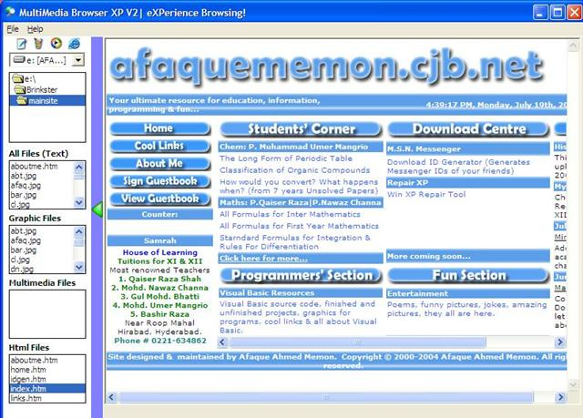



## MultiMedia Browser XP V2

### Description

MultiMedia Browser XP V2 is an All-in-one file browser. It lets you view Text Files, Photos, HTML Files and plays videos and music files in just a single click. Its look is good and its handy keyboard shortcuts make switching between files much easier. Any comments and suggestions are welcome.
 
### More Info
 

             |
---                |---
**Submitted On**   |2004-07-18 22:47:14
**By**             |[Afaque Ahmed Memon](https://github.com/Planet-Source-Code/PSCIndex/blob/master/ByAuthor/afaque-ahmed-memon.md)
**Level**          |Beginner
**User Rating**    |2.3 (7 globes from 3 users)
**Compatibility**  |VB 6\.0
**Category**       |[Complete Applications](https://github.com/Planet-Source-Code/PSCIndex/blob/master/ByCategory/complete-applications__1-27.md)
**World**          |[Visual Basic](https://github.com/Planet-Source-Code/PSCIndex/blob/master/ByWorld/visual-basic.md)
**Archive File**   |[MultiMedia1772047202004\.zip](https://github.com/Planet-Source-Code/afaque-ahmed-memon-multimedia-browser-xp-v2__1-55058/archive/master.zip)

